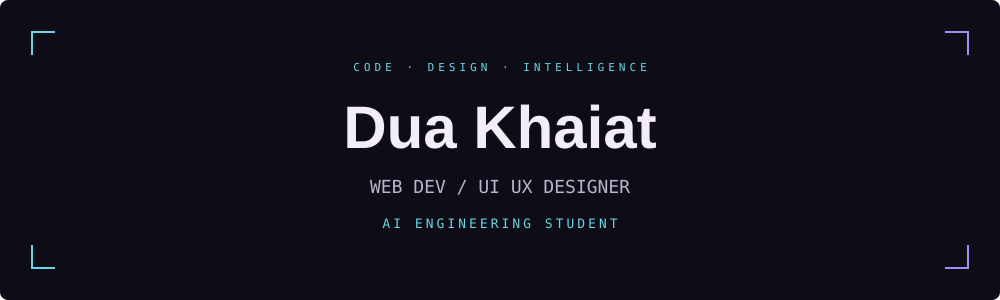
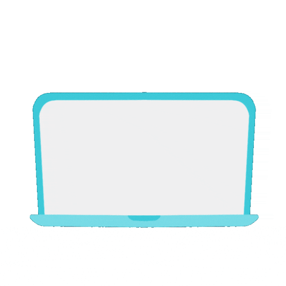
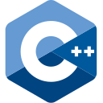
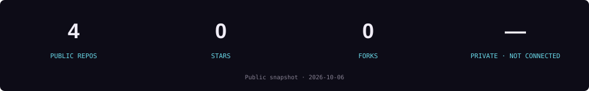
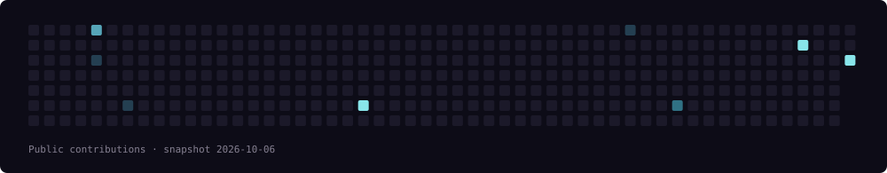

### Code with intention. Design with empathy.

## About me

I'm **Dua Khaiat**, a **Web Developer / UI UX Designer** and **AI Engineering Student**. I bring thoughtful interfaces and code together, exploring the space between web development, design, and artificial intelligence.

## My toolkit

<table align="center">
  <tr>
    <td align="center"> Python</td>
    <td align="center"> C</td>
    <td align="center"> C++</td>
    <td align="center"> Java</td>
    <td align="center"> JavaScript</td>
    <td align="center"> TypeScript</td>
  </tr>
  <tr>
    <td align="center"> HTML</td>
    <td align="center"> CSS</td>
    <td align="center"> React</td>
    <td align="center"> Tailwind CSS</td>
    <td align="center"> Node.js</td>
    <td align="center"> React Native</td>
  </tr>
  <tr>
    <td align="center"> Electron.js</td>
    <td align="center"> Tkinter</td>
    <td align="center"> PostgreSQL</td>
    <td align="center"> SQLite</td>
    <td align="center"> GitHub</td>
    <td align="center"> Arduino</td>
  </tr>
</table>

## GitHub statistics

<!-- Public snapshot verified 2026-10-06. The workflow updates this SVG including private repository counts. -->

## Activity pulse

## Selected repositories

- [**DeblurLab-Interactive-Image-Deblurring**](https://github.com/duaakhaiat/DeblurLab-Interactive-Image-Deblurring) · TypeScript
- [**ray-tracing**](https://github.com/duaakhaiat/ray-tracing) · HTML
- [**tir-lab**](https://github.com/duaakhaiat/tir-lab) · HTML
- [**track2**](https://github.com/duaakhaiat/track2) · TypeScript

---

Building at the intersection of code, design & AI. <a href="https://github.com/duaakhaiat">Let's connect on GitHub ↗</a>

