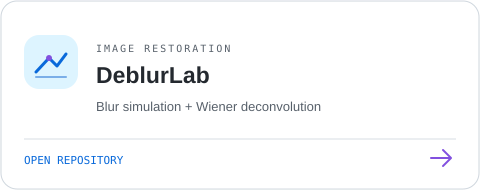
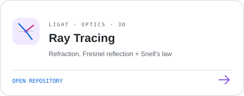
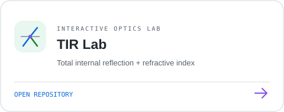
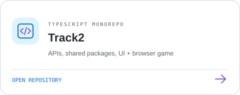

### Code with intention. Design with empathy.

## ✧ About me

I'm **Dua Khaiat**, a **Web Developer / UI UX Designer** and **AI Engineering Student**. I bring thoughtful interfaces and code together, exploring the space between web development, design, and artificial intelligence.

## ⌘ My toolkit

## ◈ GitHub statistics

<!-- Public snapshot verified 2026-10-06. The workflow updates this SVG including private repository counts. -->

## ✦ Activity pulse

## ↗ Selected repositories

Small experiments, thoughtful interfaces, and a little bit of physics.

<table align="center">
  <tr>
    <td></td>
    <td></td>
  </tr>
  <tr>
    <td></td>
    <td></td>
  </tr>
</table>

---

Building at the intersection of code, design & AI. <a href="https://github.com/duaakhaiat">Let's connect on GitHub ↗</a>

